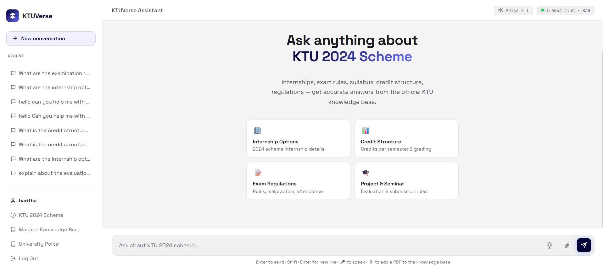
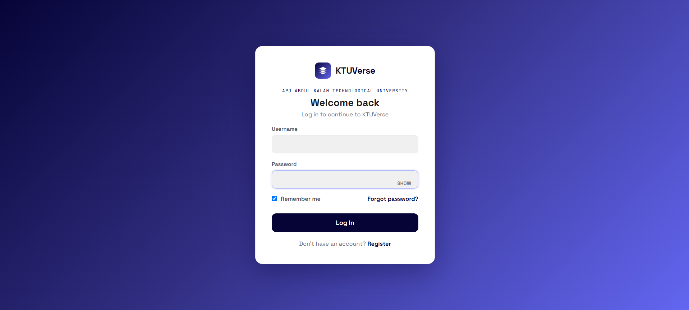
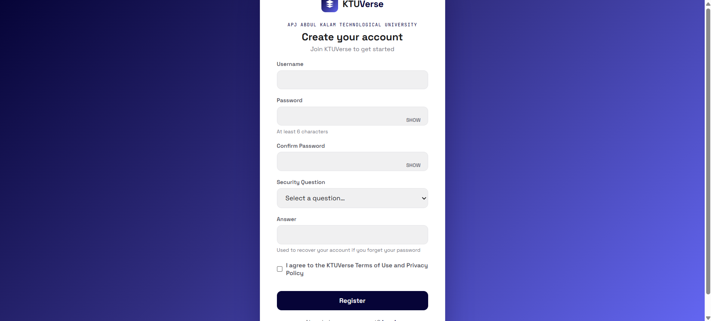
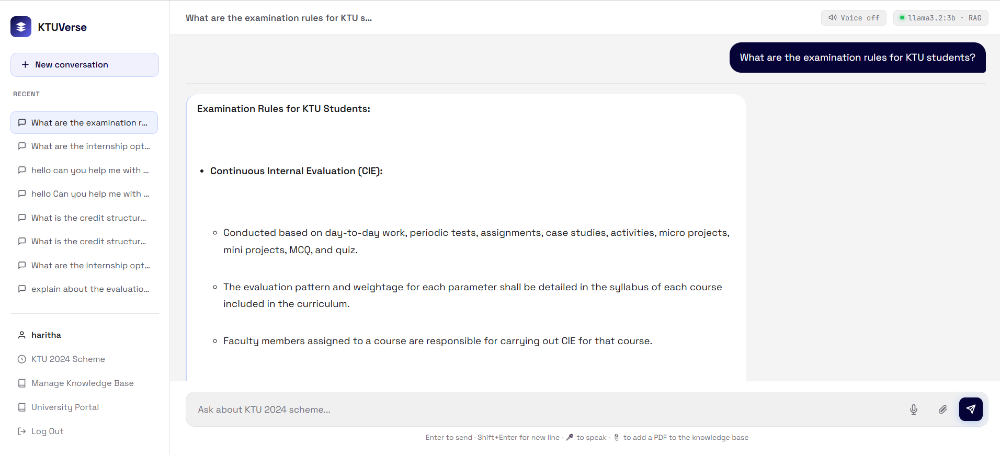
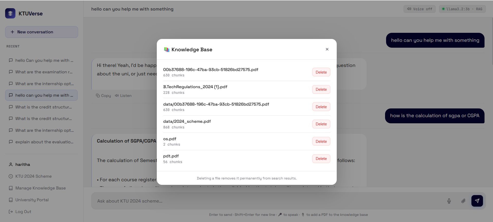

# KTUVerse

KTUVerse is a RAG-based chatbot that helps KTU (APJ Abdul Kalam Technological University) students navigate the 2024 academic scheme — covering syllabus, credit structure, exam rules, internships, and project/seminar evaluation.

It retrieves answers from official KTU documents instead of relying on general knowledge, so responses stay grounded in the actual scheme rules.

## Screenshots

### 🏠 Home Page

### 🔐 Login Page

### 📝 Register Page

### 💬 Chat Screen

### 🗑️ Delete File

## Features

- Chat interface with conversation history per user
- PDF upload to expand the knowledge base on the fly
- Knowledge base manager to view and delete indexed documents
- Voice input (speech-to-text) and voice output (text-to-speech)
- User accounts with login, registration, and password recovery via security question

## Tech Stack

- **Backend:** FastAPI, SQLite (auth & chat sessions)
- **RAG pipeline:** LangChain, Chroma (vector store), HuggingFace sentence-transformer embeddings
- **LLM:** Llama 3.2 (3B) via Ollama
- **Frontend:** HTML, CSS, JavaScript

## Project Structure